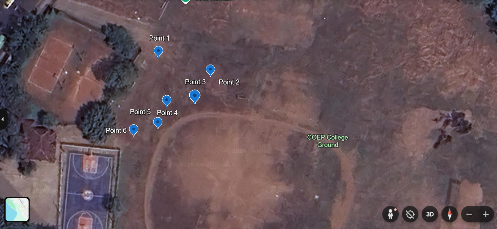

## Real-Time Human Detection and Geotagging System

### Overview
This project implements a real-time human detection and geotagging pipeline designed for aerial robotics applications.
It fuses vision-based detection with onboard telemetry to estimate precise geographic locations of detected humans.

The system has been tested and deployed on real hardware using a Pixhawk flight controller and an RGB camera.

### System Capabilities
- Real-time human detection using YOLO
- Track-to-person identity association
- GPS + IMU + LiDAR sensor fusion
- Ray–ground intersection for geolocation
- Temporal filtering and occlusion handling
- Final geotag consolidation per detected person

### Architecture
1. RGB frames captured from onboard camera
2. YOLO-based human detection and tracking
3. MAVLink telemetry ingestion (GPS, attitude, LiDAR)
4. Camera ray projection into world frame
5. Ground-plane intersection and geotag estimation
6. Temporal filtering and identity management
7. CSV and image-based output logging

### Repository Structure
- `src/` – Core geotagging pipeline
- `docs/` – System design notes and assumptions
- `requirements.txt` – Python dependencies

### Output
- Geotagged detection CSVs
- Final per-person latitude/longitude estimates
- Annotated image frames for verification
 
### Deployment & System Integration

The complete system was deployed **on-board an aerial platform**, with real-time inference
performed at the edge.

- **Compute:** NVIDIA Jetson Orin Nano  
  - GPU-accelerated inference using Docker-based deployment
- **Vision & Sensing:**
  - RGB–D data from **Intel RealSense**
  - **LiDAR** for spatial consistency and range estimation
- **Autopilot & Telemetry:**
  - **Pixhawk** flight controller for telemetry and vehicle state data
- **Deployment Architecture:**
  - Containerized inference pipeline (Docker) for reproducibility and efficient GPU utilization
  - On-board processing to avoid ground-station dependency and reduce latency

The hardware and software stack was designed to support **real-time human detection and
geotagging under aerial operating conditions**, aligning with search-and-rescue use cases.

## Field Test Results

### Live Detection — 40m Altitude

*Real-time human detection with persistent Person ID and Track ID assignment*

### Geotagged Locations — COEP Ground

*Final per-person GPS coordinates plotted on satellite imagery post-flight*

